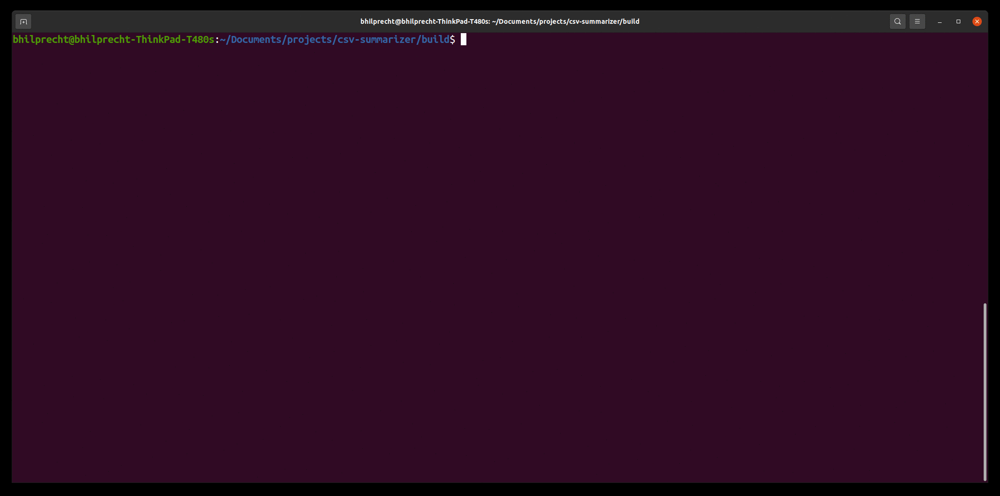

# csv-summarizer

Generates statistics about a csv file (min, max, avg, distinct values etc.). This is either done by scanning the full csv file or by sampling random rows.

## Demo



## Setup 

Install boost on the system

```
sudo apt-get install libboost-all-dev
```

The project was built on VS code with the CMake extension.

```
git clone --recurse-submodules git@github.com:bhilprecht/csv-summarizer.git
mkdir build && cd build
cmake ..
make
ln -s $(pwd)/csvsum /usr/local/bin
csvsum
```

## Usage

By default, the entire csv file is parsed (which can take time for larger files). If the statistics should be computed using a sample, specify the sample size. Do not forget to specify the correct seperator, quote and escape character if they differ from the default.

```
Usage: csv_summarizer [options] path 

Positional arguments:
path              	the location of the csv file to be summarized.

Optional arguments:
-h --help         	shows help message and exits [default: false]
-v --version      	prints version information and exits [default: false]
--sep             	specify the seperator character used for parsing. [default: ","]
-l --line_break   	specify the seperator character marking a line break. [default: "\n"]
-e --escape_char  	specify the escape character. [default: "\"]
-q --quote_char   	specify the quote character. [default: ""]
-s --sample       	number of rows to sample. [default: 0]
--no_header       	[default: false]
--verbose         	[default: false]
-n --no_most_freq 	specify the number of frequent cell values to be printed. [default: 3]
-n --block_read   	Number of characters read in a batch in the sample mode. [default: 100]
```

## Todo

- github actions
- performance
- parallelize